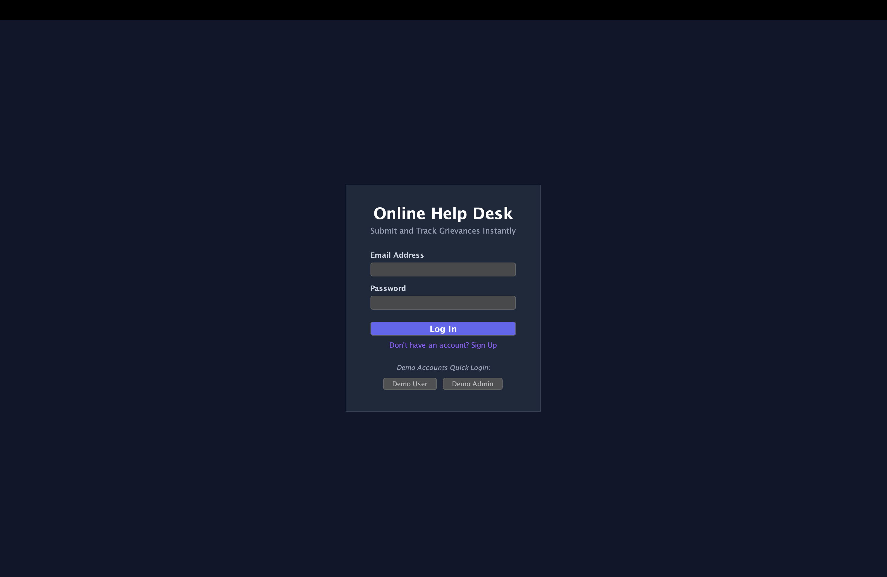
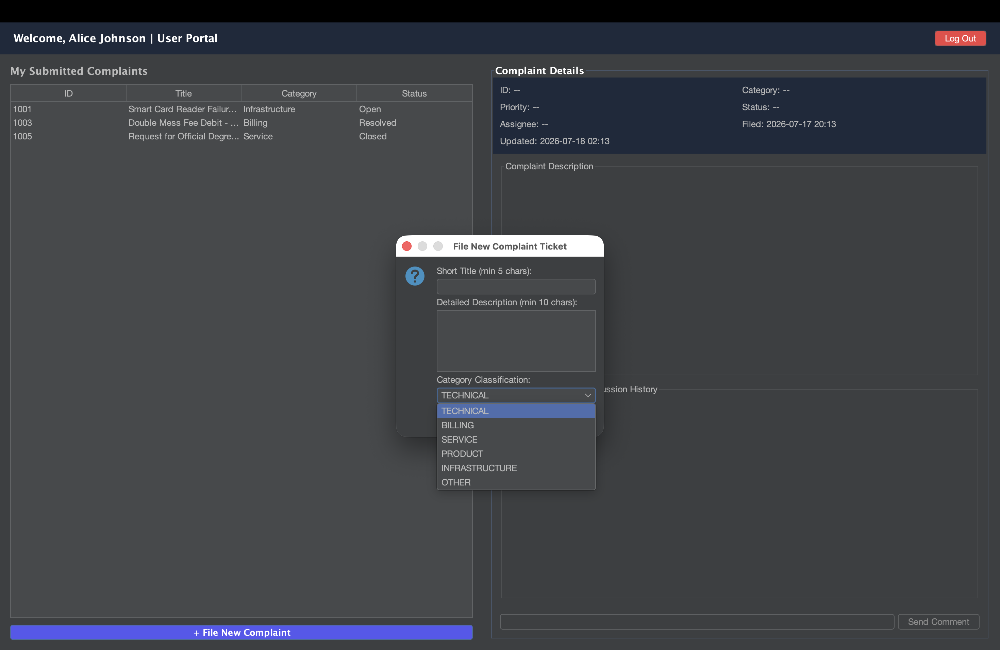
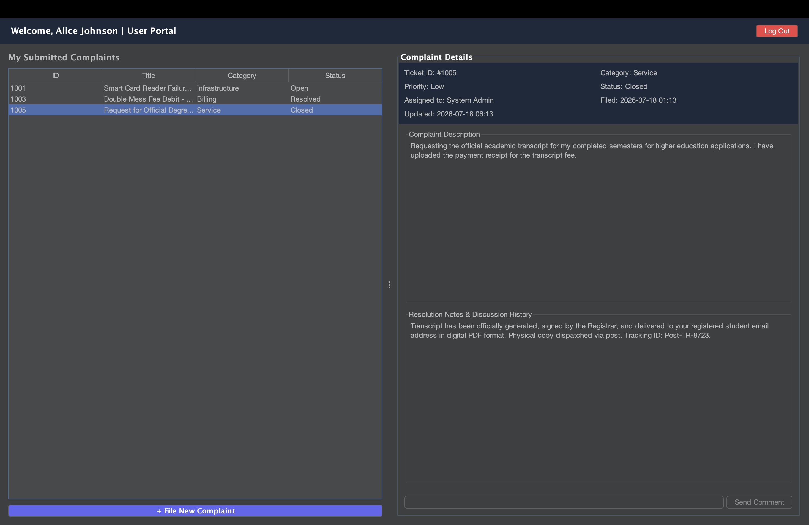

# Online Complaint Management System (Java Help Desk)

A robust, enterprise-inspired Java desktop and console application that automates the submission, tracking, assignment, and resolution of grievances, tickets, or service requests. Designed with strict **Object-Oriented Programming (OOP)** patterns, custom file-based serialization, role-based security, and transactional state validation.

---

## 📖 Project Overview & Problem Statement

### Overview
In any organization, prompt grievance redressal is critical for operational success. This application provides a dual-interface utility (Modern FlatLaf GUI & fallback CLI) to manage the entire lifecycle of complaint tickets. Standard users can file issues and add commentary, while administrative technicians assign agents, set priorities, resolve issues, and archive tickets.

### Problem Statement
Traditional manual complaint logging (spreadsheets, emails, or paper forms) suffers from:
* **Zero Accountability**: No clear owner assigned to fix issues.
* **Opacity of Status**: Users must constantly ping staff for progress.
* **Poor Prioritization**: Severe problems (e.g., infrastructural water leakage) get buried under non-urgent ones.
* **Lack of Data Auditing**: No timeline logs tracking who did what and when.

This system replaces manual bottlenecks with a structured state machine, bringing transparency and metrics tracking to help desks.

---

## 💼 Industry Relevance

Similar architectures (Service Tickets/Case Management) form the backend core of industry tools like:
* **Jira Service Management & ServiceNow (IT Service Desks)**: Handling enterprise incidence triaging.
* **Zendesk & Salesforce Service Cloud (Customer Support)**: Aligning customer issues to SLA milestones.
* **Banking Dispute Portals**: Managing card chargeback workflows with strict transactional audit trails.
* **Municipal Grievance Desks**: Assigning local civic works tickets dynamically.

---

## 📐 Java Concepts Implemented

* **Encapsulation**: Private class fields accessed exclusively via type-safe getters/setters with inline validations.
* **Separation of Concerns**: Division into domain models (`com.complaint.model`), business rules (`com.complaint.service`), persistence repositories (`com.complaint.utility`), and layout presentation controllers (`com.complaint.gui` and `com.complaint.main`).
* **Concurrency Safety**: Crucial service methods are declared `synchronized` to prevent primary key/ID collisions when multiple threads write data simultaneously.
* **Modern Collections**: `ArrayList` and Streams API utilized for multi-criteria filters and keyword searches.
* **Enums**: Strict type-safety using enums for Roles, Statuses, Priorities, and Categories.
* **Date & Time (`java.time`)**: Capturing file dates and updates using `LocalDateTime` to log accurate audit trails.
* **File I/O Stream Handling**: Direct persistence via `BufferedReader` and `BufferedWriter` to local text databases.

---

## 🌟 Complete Feature Suite

* **Secure Authentication**: Username/password matching with role assignment (Standard `USER` vs. `ADMIN`).
* **Interactive Dashboard**: Modern FlatLaf Dark Look and Feel desktop interface with quick demo-login hooks.
* **Unique ID Generation**: Secure, auto-incremented reference IDs.
* **Metadata Triage**: Category classification and priority scaling (`Low`, `Medium`, `High`, `Critical`).
* **Discussion Timelines**: Live commentary chat log appended directly inside each ticket file.
* **Dynamic Search**: Filter by status, category, priority, or owner.
* **Safe Exit Hook**: Execution hook flushes cached memory lists safely to files on shutdown.

---

## 🔄 Complaint Lifecycle

The status of a ticket follows a strict programmatic state-machine pipeline:

```
+----------+       +------------+       +-------------+       +------------+       +----------+
|   OPEN   | ----> |  ASSIGNED  | ----> | IN_PROGRESS | ----> |  RESOLVED  | ----> |  CLOSED  |
+----------+       +------------+       +-------------+       +------------+       +----------+
     |                   |
     v                   v
+------------------------+
|        REJECTED        |
+------------------------+
```

* **OPEN**: User submits a complaint. Awaiting admin review.
* **ASSIGNED**: Admin assigns a technician assignee name.
* **IN_PROGRESS**: Technician starts work.
* **RESOLVED**: Technician completes work and writes resolution details.
* **CLOSED**: Ticket is officially archived and turns read-only.
* **REJECTED**: Ticket is flagged as spam or duplicate.

---

## 🏗️ System Architecture

```
+-----------------------------------------------------------+
|                       Main Entry (MainGui)                |
|           Visual GUI Panels, Event Listeners, CardLayout  |
+------------------------------------+----------------------+
                                     | (Service Calls)
                                     v
+-----------------------------------------------------------+
|                     Service Layers                        |
|       UserService  |  ComplaintService (Business Logic)   |
+------------------------------------+----------------------+
                                     | (DAO Methods)
                                     v
+-----------------------------------------------------------+
|                       Storage Utility                     |
|           FileManager.java (Reads/Writes flat files)      |
+------------------------------------+----------------------+
                                     | (Pipe Delimiter "|")
                                     v
+-----------------------------------------------------------+
|                    Persistence Database                   |
|                  data/users.txt  |  data/complaints.txt   |
+-----------------------------------------------------------+
```

---

## 📂 Project Folder Structure

```
Online-Complaint-Management-System-Java/
├── src/
│   └── main/
│       └── java/
│           └── com/
│               └── complaint/
│                   ├── model/        # Domain classes (User, Complaint, Enums)
│                   ├── service/      # Business operations and transition constraints
│                   ├── utility/      # Disk storage database reader/writer (FileManager)
│                   ├── gui/          # Graphical Swing user interface (MainGui)
│                   └── main/         # Command-line entry (Main fallback)
├── data/                             # Local database files
│   ├── users.txt
│   └── complaints.txt
├── screenshots/                      # Demo showcase visual grabs
├── pom.xml                           # Maven project config dependencies
└── README.md                         # Detailed project catalog
```

---

## 💾 Local Storage Design
To avoid third-party DB setups for recruiters, the database resides in `/data/` as pipe-delimited files:
* **Encoding**: Multi-line descriptions are escaped with `\n` and pipes with `\pipe` on save, and reverted back on load, preventing CSV row corruption.
* **Seed Data**: If files do not exist, the services automatically generate the folder and seed default accounts and active complaints.

---

## 🚀 How to Run the App

### 📦 Setup & Package
1. Compile the Java files:
   ```bash
   mvn clean compile
   ```
2. Build the jar archive:
   ```bash
   mvn clean package
   ```

### ⚙️ Launch Options
* **Run GUI (Default)**:
  ```bash
  mvn exec:java
  ```
* **Run CLI Fallback**:
  ```bash
  mvn exec:java -Dexec.mainClass="com.complaint.main.Main"
  ```

---

## 🕹️ Sample Output Traces

### CLI Fallback Main Menu:
```
==================================================
  WELCOME TO ONLINE COMPLAINT MANAGEMENT SYSTEM   
==================================================

--------------------------------------------------
1. Log In
2. Register New User Account
3. Exit Application
[?] Select an option (1-3): 1
```

### CLI Complaints Registry Row Display:
```
----------------------------------------------------------------------------------------------------
| ID    | TITLE                          | CATEGORY     | PRIORITY   | STATUS       | ASSIGNEE        |
----------------------------------------------------------------------------------------------------
| 1001  | Smart Card Reader Failure a... | Infrastructure | Critical   | Open         | Unassigned      |
| 1002  | Water Leakage in Chemistry ... | Infrastructure | Medium     | In Progress  | Tech Agent      |
| 1003  | Double Mess Fee Debit - Tra... | Billing      | Medium     | Resolved     | System Admin    |
----------------------------------------------------------------------------------------------------
```

---

## 🖼️ screenshots

Here is the visual walkthrough of the application in action:

### 1. Modern Login Screen (FlatLaf Dark Theme)


### 2. Standard User Dashboard (File new ticket)


### 3. Interactive Ticket Details & Comment Timeline


### 4. Admin operations control Desk & Filter Registry


---

## 🛑 Project Limitations & Future Roadmap

### Limitations
1. **In-Memory Cache**: Loads all data into RAM on startup, limiting scale.
2. **Text Database Security**: Passwords are saved in plain-text inside `users.txt` (needs cryptographic hashing like BCrypt).
3. **No File Attachments**: Users cannot upload images of the issues.

### Future Roadmap
1. **Spring Boot Migration**: Expose RESTful endpoints backed by Spring Security OAuth2.
2. **Relational Database**: Connect via Spring Data JPA to a persistent MySQL database.
3. **AI Triaging**: Auto-classify tickets using LLMs (e.g., LangChain4j integration).

---

## 🎓 Key Learning Outcomes

1. **System State Validation**: Enforced business transitions through code states, handling errors via clean exceptions.
2. **Custom File Parsing**: Designed manual database serialization engines using java stream readers.
3. **Interface Design**: Developed custom cell renderers and CardLayout layouts in JFrames using FlatLaf.
4. **Thread Safety**: Explored race conditions and implemented `synchronized` mutex locking.

---

## ✍️ Author
* **Your Name** - [GitHub Profile](https://github.com/your-username)
* Contact Email: `your.email@example.com`
* Course Project: Java Programming Lab (2026)
